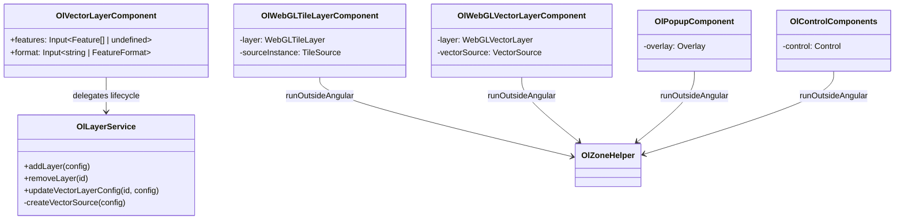

# Technical Design: OpenLayers Component Disposal & Native Sources Refactoring

This document outlines the technical design for refactoring `@angular-helpers/openlayers` to ensure complete disposal of native OpenLayers instances (layers, sources, controls, overlays) upon component destruction or re-configuration. It also details support for native `FeatureFormat` instances and non-destructive feature synchronization when a remote URL is configured.

---

## 1. Overview & Goals

- **Zero Memory Leaks**: Ensure that all native OpenLayers objects (`Map`, `Layer`, `Source`, `Overlay`, `Control`) are explicitly disposed of when their wrapping Angular components are destroyed or when their configurations are dynamically updated.
- **Outside Angular Zone**: Execute all creation, addition, removal, and disposal operations outside Angular's zone via `OlZoneHelper.runOutsideAngular` to prevent unnecessary change detection cycles.
- **Native FeatureFormat Support**: Allow the `format` configuration to accept native OpenLayers `FeatureFormat` instances directly in addition to string shorthands (`'geojson' | 'topojson' | 'kml'`).
- **Robust Feature Synchronization**: Prevent the feature synchronization effect from clearing features when a remote `url` is configured and `features` is `undefined`.

---

## 2. Detailed Component & Service Changes



### 2.1. Layer Config Types

**File**: [layer.types.ts](file:///home/gasparrv92/Repositorios/angular-helpers/packages/openlayers/layers/src/models/layer.types.ts)

Update `VectorLayerConfig` to allow `FeatureFormat` instances.

```typescript
import FeatureFormat from 'ol/format/Feature';

export interface VectorLayerConfig extends LayerConfig {
  type: 'vector';
  features?: Feature[];
  url?: string;
  format?: 'geojson' | 'topojson' | 'kml' | FeatureFormat; // Updated
  style?: Style | ((feature: Feature) => Style);
  cluster?: ClusterConfig;
  coordinateProjection?: string;
}
```

### 2.2. Vector Layer Component

**File**: [vector-layer.component.ts](file:///home/gasparrv92/Repositorios/angular-helpers/packages/openlayers/layers/src/features/vector-layer.component.ts)

- Update `features` input to be optional and default to `undefined`.
- Update `format` input type to accept `FeatureFormat` instances.
- Modify the feature synchronization effect to prevent clearing the source when `url` is configured and `features` is `undefined`.

```typescript
import FeatureFormat from 'ol/format/Feature';

// ...
export class OlVectorLayerComponent {
  // ...
  features = input<Feature[] | undefined>(undefined); // Updated
  format = input<'geojson' | 'topojson' | 'kml' | FeatureFormat>(); // Updated

  constructor() {
    // ...

    // Effect to sync features when input changes
    effect(() => {
      const currentFeatures = this.features();
      // FR-9: Skip updating features if features is undefined and url is configured
      if (currentFeatures === undefined && this.url()) {
        return;
      }
      if (this.layerService.getLayer(this.id())) {
        this.layerService.updateFeatures(this.id(), currentFeatures);
      }
    });

    // ...
  }
}
```

### 2.3. Layer Service

**File**: [layer.service.ts](file:///home/gasparrv92/Repositorios/angular-helpers/packages/openlayers/layers/src/services/layer.service.ts)

- Inject `OlZoneHelper` to run creation and disposal outside the Angular zone.
- Update `createVectorSource` to check if `format` is an instance of `FeatureFormat` and use it directly.
- Update `createLayer` to wrap source/layer creation and addition in `OlZoneHelper.runOutsideAngular`.
- Update `updateVectorLayerConfig` to explicitly clear and dispose of the old source(s) (including nested cluster sources) and wrap new source creation in `runOutsideAngular`.
- Update `removeLayer` to wrap all removal and disposal logic in `runOutsideAngular`.

```typescript
import FeatureFormat from 'ol/format/Feature';
import { OlZoneHelper } from '@angular-helpers/openlayers/core';

@Injectable()
export class OlLayerService {
  private mapService = inject(OlMapService);
  private zoneHelper = inject(OlZoneHelper); // Added
  // ...

  private createVectorSource(config: VectorLayerConfig, _map: OLMap): VectorSource {
    const sourceOptions: { url?: string; format?: any } = {};

    if (config.url) {
      sourceOptions.url = config.url;
    }

    if (config.format) {
      if (config.format instanceof FeatureFormat) {
        sourceOptions.format = config.format;
      } else if (config.format === 'geojson') {
        sourceOptions.format = new GeoJSON();
      } else if (config.format === 'topojson') {
        sourceOptions.format = new TopoJSON();
      } else if (config.format === 'kml') {
        sourceOptions.format = new KML();
      }
    }

    return new VectorSource(sourceOptions);
  }

  private createLayer(config: AnyLayerConfig, map: OLMap): { id: string } {
    let layer: BaseLayer;

    this.zoneHelper.runOutsideAngular(() => {
      switch (config.type) {
        case 'vector': {
          const vConfig = config as VectorLayerConfig;
          const vectorSource = this.createVectorSource(vConfig, map);
          // ... (rest of vector source/cluster creation)
          layer = buildVectorLayer(vConfig, source);
          break;
        }
        // ... (other layer types)
      }
    });

    if (!layer!) return { id: config.id };

    this.zoneHelper.runOutsideAngular(() => {
      map.addLayer(layer);
    });

    this.layerCache.set(config.id, layer);
    this.updateLayerState();
    return { id: config.id };
  }

  removeLayer(id: string): void {
    // ...
    const map = this.mapService.getMap();
    const layer = this.layerCache.get(id);
    if (map && layer) {
      this.zoneHelper.runOutsideAngular(() => {
        map.removeLayer(layer);

        if ('getSource' in layer) {
          const source = (layer as any).getSource();
          if (source) {
            if ('getSource' in source && typeof (source as any).getSource === 'function') {
              const underlying = (source as any).getSource();
              if (underlying && typeof underlying.dispose === 'function') {
                if (typeof underlying.clear === 'function') underlying.clear(true);
                underlying.dispose();
              }
            }
            if (typeof source.dispose === 'function') {
              if (typeof source.clear === 'function') source.clear(true);
              source.dispose();
            }
          }
        }
        layer.dispose();
      });
      this.layerCache.delete(id);
      this.updateLayerState();
    }
  }

  updateVectorLayerConfig(id: string, config: Partial<VectorLayerConfig>): void {
    const layer = this.layerCache.get(id);
    if (!(layer instanceof VectorLayer)) return;

    const oldSource = layer.getSource();
    const map = this.mapService.getMap();
    const nextConfig = {
      ...(layer.get('cluster-config') ? { cluster: layer.get('cluster-config') } : {}),
      ...(layer.get('style-fn') !== undefined ? { style: layer.get('style-fn') } : {}),
      ...config,
    } as VectorLayerConfig;

    let nextSource: VectorSource;
    let clusterSource: ClusterSource | undefined;

    this.zoneHelper.runOutsideAngular(() => {
      nextSource = this.createVectorSource(nextConfig, map ?? ({} as OLMap));
      const clusterCfg = nextConfig.cluster;
      if (clusterCfg?.enabled) {
        clusterSource = new ClusterSource({
          source: nextSource,
          // ...
        });
      }
    });

    if (clusterSource) {
      layer.setSource(clusterSource);
    } else {
      layer.setSource(nextSource!);
    }

    if (oldSource) {
      this.zoneHelper.runOutsideAngular(() => {
        if ('getSource' in oldSource && typeof (oldSource as any).getSource === 'function') {
          const underlying = (oldSource as any).getSource();
          if (underlying && typeof underlying.dispose === 'function') {
            if (typeof underlying.clear === 'function') underlying.clear(true);
            underlying.dispose();
          }
        }
        if (typeof oldSource.dispose === 'function') {
          if (typeof oldSource.clear === 'function') oldSource.clear(true);
          oldSource.dispose();
        }
      });
    }

    layer.set('coordinate-projection', nextConfig.coordinateProjection ?? 'EPSG:4326');
    this.updateFeatures(id, nextConfig.features ?? []);
    this.updateLayerState();
  }
}
```

### 2.4. WebGL Tile Layer Component

**File**: [webgl-tile-layer.component.ts](file:///home/gasparrv92/Repositorios/angular-helpers/packages/openlayers/layers/src/features/webgl-tile-layer.component.ts)

- Inject `OlZoneHelper`.
- Store a reference to the instantiated tile source (`private sourceInstance: any = null;`).
- Dispose of both the source and the WebGL layer inside `DestroyRef.onDestroy`, wrapped in `runOutsideAngular`.

```typescript
import { OlZoneHelper } from '@angular-helpers/openlayers/core';

export class OlWebGLTileLayerComponent {
  private zoneHelper = inject(OlZoneHelper);
  private sourceInstance: any = null;

  constructor() {
    afterNextRender(() => {
      // ...
      let tileSource;
      switch (this.source()) {
        case 'mvt':
          tileSource = new VectorTileSource({ ... });
          this.layer = new WebGLVectorTileLayer({ source: tileSource as any, ... });
          break;
        // ...
      }
      this.sourceInstance = tileSource;
      // ...
    });

    this.destroyRef.onDestroy(() => {
      const map = this.mapService.getMap();
      this.zoneHelper.runOutsideAngular(() => {
        if (map && this.layer) {
          map.removeLayer(this.layer);
        }
        if (this.sourceInstance && typeof this.sourceInstance.dispose === 'function') {
          this.sourceInstance.dispose();
        }
        if (this.layer) {
          this.layer.dispose();
        }
      });
    });
  }
}
```

### 2.5. WebGL Vector Layer Component

**File**: [webgl-vector-layer.component.ts](file:///home/gasparrv92/Repositorios/angular-helpers/packages/openlayers/layers/src/features/webgl-vector-layer.component.ts)

- Inject `OlZoneHelper`.
- Clear and dispose of `vectorSource`, and dispose of `layer` inside `DestroyRef.onDestroy`, wrapped in `runOutsideAngular`.

```typescript
import { OlZoneHelper } from '@angular-helpers/openlayers/core';

export class OlWebGLVectorLayerComponent {
  private zoneHelper = inject(OlZoneHelper);
  // ...

  constructor() {
    // ...
    this.destroyRef.onDestroy(() => {
      const map = this.mapService.getMap();
      this.zoneHelper.runOutsideAngular(() => {
        if (map && this.layer) {
          map.removeLayer(this.layer);
        }
        if (this.vectorSource) {
          this.vectorSource.clear(true);
          this.vectorSource.dispose();
        }
        if (this.layer) {
          try {
            this.layer.dispose();
          } catch {
            // Ignore WebGL layer disposal errors
          }
        }
      });
    });
  }
}
```

### 2.6. Popup Overlay Component

**File**: [popup.component.ts](file:///home/gasparrv92/Repositorios/angular-helpers/packages/openlayers/overlays/src/features/popup.component.ts)

- Update `dispose` to explicitly call `.dispose()` on the `Overlay` instance.

```typescript
  private dispose(): void {
    if (!this.overlay || !this.currentMap) return;
    const overlay = this.overlay;
    const map = this.currentMap;
    this.zoneHelper.runOutsideAngular(() => {
      if (this.wasVisible) map.removeOverlay(overlay);
      overlay.dispose(); // Added
    });
    this.overlay = null;
    this.currentMap = null;
  }
```

### 2.7. Control Components

**Files**:

- [attribution-control.component.ts](file:///home/gasparrv92/Repositorios/angular-helpers/packages/openlayers/controls/src/features/attribution-control.component.ts)
- [fullscreen-control.component.ts](file:///home/gasparrv92/Repositorios/angular-helpers/packages/openlayers/controls/src/features/fullscreen-control.component.ts)
- [rotate-control.component.ts](file:///home/gasparrv92/Repositorios/angular-helpers/packages/openlayers/controls/src/features/rotate-control.component.ts)
- [scale-line-control.component.ts](file:///home/gasparrv92/Repositorios/angular-helpers/packages/openlayers/controls/src/features/scale-line-control.component.ts)
- [zoom-control.component.ts](file:///home/gasparrv92/Repositorios/angular-helpers/packages/openlayers/controls/src/features/zoom-control.component.ts)
- [geolocation-control.component.ts](file:///home/gasparrv92/Repositorios/angular-helpers/packages/openlayers/controls/src/features/geolocation-control.component.ts)

Update all control components' destruction logic to call `.dispose()` on their respective `Control` instances.

```typescript
destroyRef.onDestroy(() => {
  if (this.control) {
    const map = this.mapService.getMap();
    this.zoneHelper.runOutsideAngular(() => {
      if (map) map.removeControl(this.control!);
      this.control!.dispose(); // Added
    });
  }
  destroyed = true;
});
```

_Note for `OlGeolocationControlComponent`_: Also dispose of its internal `Geolocation` and `VectorLayer` / `VectorSource`.

```typescript
this.destroyRef.onDestroy(() => {
  const map = this.mapService.getMap();
  this.zoneHelper.runOutsideAngular(() => {
    if (map) {
      if (this.control) map.removeControl(this.control);
      if (this.layer) map.removeLayer(this.layer);
    }
    if (this.geolocation) {
      this.geolocation.setTracking(false);
      this.geolocation.dispose();
    }
    if (this.layer) {
      const source = this.layer.getSource();
      if (source) {
        source.clear(true);
        source.dispose();
      }
      this.layer.dispose();
    }
    if (this.control) {
      this.control.dispose();
    }
  });
});
```

---

## 3. Testing Strategy

We will write unit tests using **Vitest** to verify all architectural changes.

### 3.1. Disposal Verification

- **Control Components**: Test that `dispose` is called on the `Control` instance when the component is destroyed.
- **Popup Component**: Test that `dispose` is called on the `Overlay` instance when the component is destroyed.
- **WebGL Components**: Test that `dispose` is called on the layer and source instances when the component is destroyed.
- **Layer Service**: Test that when `updateVectorLayerConfig` is called, the old source (and its nested source if clustered) has `.clear(true)` and `.dispose()` called on it.

### 3.2. FeatureFormat Resolution

- Test `OlLayerService.createVectorSource` by passing a custom native `FeatureFormat` instance (e.g., `new GeoJSON()` or `new KML()`) and asserting that the created `VectorSource` uses that exact instance.
- Test passing a string shorthand (`'geojson'`) and asserting that a new `GeoJSON` instance is created and used.

### 3.3. Feature Synchronization

- Test that if `features` is `undefined` and `url` is configured, the layer's source features are NOT cleared (i.e., `updateFeatures` is skipped).
- Test that if `features` is explicitly set to `[]` (empty array), the features are synchronized and cleared.
