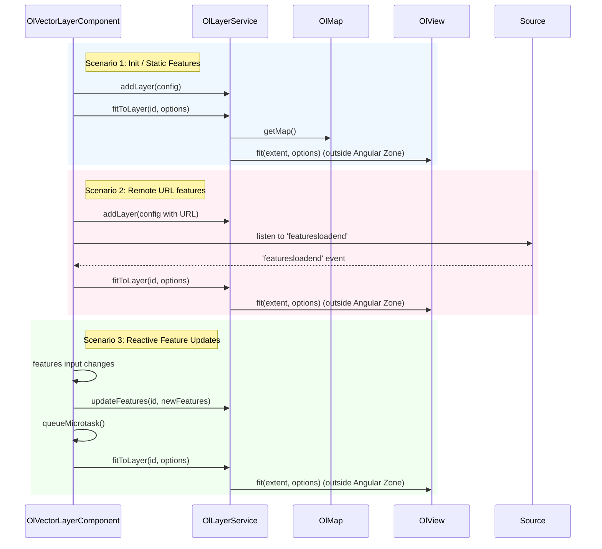

# Design: OpenLayers Package — Auto-Fitting Vector Layers (`autoFit`)

This document details the technical design for implementing the `autoFit` feature on vector layers in the `@angular-helpers/openlayers` package.

---

## 1. Overview & Architecture

The `autoFit` feature allows an `OlVectorLayerComponent` to automatically fit the map's view to the extent of its features. This fitting needs to occur:

1. On initial load/render (for static features).
2. When remote features finish loading asynchronously (via the `'featuresloadend'` event).
3. When the `features` input array changes reactively.

To avoid performance degradation and unnecessary Angular change detection cycles, the map view fitting logic will be executed outside the Angular zone via `OlZoneHelper.runOutsideAngular`.

### Component & Service Interaction



---

## 2. Detailed File Changes

### 2.1. `packages/openlayers/layers/src/models/layer.types.ts`

We will define the `AutoFitOptions` interface and update `VectorLayerConfig` to support the `autoFit` property.

```typescript
// Add AutoFitOptions interface
export interface AutoFitOptions {
  padding?: number[];
  duration?: number;
}

// Update VectorLayerConfig
export interface VectorLayerConfig extends LayerConfig {
  type: 'vector';
  features?: Feature[];
  url?: string;
  format?: 'geojson' | 'topojson' | 'kml' | FeatureFormat;
  style?: Style | ((feature: Feature) => Style);
  cluster?: ClusterConfig;
  coordinateProjection?: string;
  autoFit?: boolean | AutoFitOptions; // Added property
}
```

### 2.2. `packages/openlayers/layers/src/services/layer.service.ts`

We will add the `fitToLayer` method to `OlLayerService`. This method is responsible for retrieving the layer, unwrapping the source if it is clustered, calculating the extent, validating it, and fitting the view.

```typescript
  /**
   * Fits the map view to the extent of the specified vector or heatmap layer.
   * Runs outside the Angular zone to prevent triggering change detection.
   */
  fitToLayer(id: string, options?: AutoFitOptions): void {
    const map = this.mapService.getMap();
    if (!map) return;

    const layer = this.layerCache.get(id);
    if (!layer || !(layer instanceof VectorLayer || layer instanceof HeatmapLayer)) return;

    const source = (layer as any).getSource();
    if (!source) return;

    // Unwrap ClusterSource to the underlying VectorSource if necessary
    const vectorSource =
      'getSource' in source && typeof source.getSource === 'function'
        ? source.getSource()
        : source;

    if (!vectorSource || typeof vectorSource.getExtent !== 'function') return;

    const extent = vectorSource.getExtent();

    // Validate extent: must be of length 4, all elements finite, and not the default empty extent
    if (
      !extent ||
      extent.length !== 4 ||
      !extent.every((val: number) => isFinite(val)) ||
      (extent[0] === Infinity &&
        extent[1] === Infinity &&
        extent[2] === -Infinity &&
        extent[3] === -Infinity)
    ) {
      return;
    }

    const view = map.getView();
    if (!view) return;

    this.zoneHelper.runOutsideAngular(() => {
      view.fit(extent, {
        padding: options?.padding,
        duration: options?.duration,
      });
    });
  }
```

### 2.3. `packages/openlayers/layers/src/features/vector-layer.component.ts`

We will:

1. Expose the `autoFit` input.
2. Inject `OlMapService` to handle asynchronous layer initialization.
3. Update `afterNextRender` to listen to the `'featuresloadend'` event (if a URL is provided) or trigger an immediate fit.
4. Update the feature synchronization `effect` to trigger `fitToLayer` in a microtask when features are updated.

```typescript
// ... existing imports ...
import { OlMapService } from '@angular-helpers/openlayers/core'; // Import map service
import type { AutoFitOptions, ClusterConfig, VectorLayerConfig } from '../models/layer.types';

@Component({
  selector: 'ol-vector-layer',
  template: '',
})
export class OlVectorLayerComponent {
  private layerService = inject(OlLayerService);
  private mapService = inject(OlMapService); // Injected mapService
  private destroyRef = inject(DestroyRef);

  id = input.required<string>();
  features = input<Feature[] | undefined>(undefined);
  url = input<string>();
  format = input<'geojson' | 'topojson' | 'kml' | FeatureFormat>();
  zIndex = input<number>(0);
  opacity = input<number>(1);
  visible = input<boolean>(true);
  style = input<any | ((feature: Feature, resolution: number) => any)>();
  cluster = input<ClusterConfig>();
  clusterComponent = contentChild(OlClusterComponent);
  coordinateProjection = input<string>('EPSG:4326');

  // New input
  autoFit = input<boolean | AutoFitOptions>(false);

  constructor() {
    // Initialize layer after DOM is ready
    afterNextRender(() => {
      const clusterCmp = this.clusterComponent();
      const resolvedClusterConfig: ClusterConfig | undefined =
        this.cluster() ??
        (clusterCmp
          ? {
              enabled: true,
              distance: clusterCmp.distance(),
              minDistance: clusterCmp.minDistance(),
              showCount: clusterCmp.showCount(),
              featureStyle: clusterCmp.featureStyle(),
              spiderfyOnSelect: clusterCmp.spiderfyOnSelect(),
              onSpiderfyClick: (f) => clusterCmp.spiderfyClick.emit(f),
            }
          : undefined);

      this.layerService.addLayer({
        id: this.id(),
        type: 'vector',
        features: this.features(),
        url: this.url(),
        format: this.format(),
        zIndex: this.zIndex(),
        opacity: this.opacity(),
        visible: this.visible(),
        style: this.style(),
        cluster: resolvedClusterConfig,
        coordinateProjection: this.coordinateProjection(),
        autoFit: this.autoFit(), // Pass autoFit config
      } as VectorLayerConfig);

      // Handle autoFit on initialization
      const autoFitActive = this.autoFit();
      if (autoFitActive) {
        const parsedOptions = typeof autoFitActive === 'object' ? autoFitActive : undefined;

        const setupFitListener = () => {
          const layer = this.layerService.getLayer(this.id());
          if (layer && 'getSource' in layer) {
            const source = (layer as any).getSource();
            if (source) {
              const vectorSource =
                'getSource' in source && typeof source.getSource === 'function'
                  ? source.getSource()
                  : source;

              if (vectorSource) {
                if (this.url()) {
                  // Wait for features to load asynchronously
                  vectorSource.on('featuresloadend', () => {
                    this.layerService.fitToLayer(this.id(), parsedOptions);
                  });
                } else {
                  // Fit immediately for static features
                  this.layerService.fitToLayer(this.id(), parsedOptions);
                }
              }
            }
          }
        };

        const map = this.mapService.getMap();
        if (map) {
          setupFitListener();
        } else {
          this.mapService.onReady(() => {
            setupFitListener();
          });
        }
      }
    });

    // Effect to sync features when input changes
    effect(() => {
      const currentFeatures = this.features();
      if (currentFeatures === undefined && this.url()) {
        return;
      }
      if (this.layerService.getLayer(this.id())) {
        this.layerService.updateFeatures(this.id(), currentFeatures);

        // Fit to layer reactively if autoFit is active
        const autoFitActive = this.autoFit();
        if (autoFitActive) {
          const parsedOptions = typeof autoFitActive === 'object' ? autoFitActive : undefined;
          queueMicrotask(() => {
            this.layerService.fitToLayer(this.id(), parsedOptions);
          });
        }
      }
    });

    // ... other effects ...
  }
}
```

---

## 3. Testing Strategy

We will use **Vitest** to verify the implementation.

### 3.1. `OlLayerService` Unit Tests

In `packages/openlayers/layers/src/services/layer.service.spec.ts`, we will add tests for `fitToLayer`:

1. **Successful view fitting**:
   - Mock a `VectorLayer` with a `VectorSource` that has a valid extent.
   - Call `fitToLayer` and verify that `view.fit` is called with the correct extent and options (padding, duration).
   - Verify that it runs within `runOutsideAngular`.
2. **Cluster source unwrapping**:
   - Mock a `VectorLayer` with a `ClusterSource` wrapping a `VectorSource`.
   - Verify that `fitToLayer` correctly calls `source.getSource()` and fits the map view to the underlying source's extent.
3. **Invalid/Empty Extent validation**:
   - Verify that `fitToLayer` returns early and does not call `view.fit` if the extent is empty (e.g., `[Infinity, Infinity, -Infinity, -Infinity]`) or contains non-finite numbers.
4. **Missing Layer/Map gracefulness**:
   - Verify that `fitToLayer` returns early without throwing if the layer is missing or the map has not been initialized.

### 3.2. `OlVectorLayerComponent` Unit Tests

In `packages/openlayers/layers/src/features/vector-layer.component.spec.ts`, we will add tests to verify the integration:

1. **Static features auto-fit on init**:
   - Build a harness with `[features]="staticFeatures"` and `[autoFit]="true"`.
   - Verify that `layerService.fitToLayer` is called upon component initialization.
2. \*\*Remote features auto-fit on `'featuresloadend'`:
   - Build a harness with `[url]="'https://example.com'"` and `[autoFit]="{ padding: [10], duration: 150 }"`.
   - Retrieve the mocked source, trigger the `'featuresloadend'` event.
   - Verify that `layerService.fitToLayer` is called with the custom options.
3. **Reactive features auto-fit**:
   - Build a harness with `[features]="initialFeatures"` and `[autoFit]="true"`.
   - Update the `features` input to `newFeatures`.
   - Wait for the microtask queue to flush (`await Promise.resolve()`).
   - Verify that `layerService.fitToLayer` is called again.
