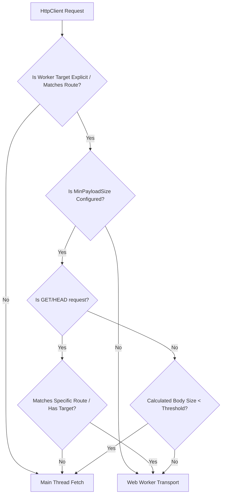

# Design: `@angular-helpers/worker-http` Performance Improvements

This document details the technical design for the performance improvements in the `@angular-helpers/worker-http` package. These improvements are based on the specifications defined in [spec-worker-http-performance.md](file:///home/gasparrv92/Repositorios/angular-helpers/.sdd/spec-worker-http-performance.md).

---

## 1. Architectural Overview

The performance optimizations target two primary overheads in the current worker HTTP pipeline:

1. **IPC Context-Switching Overhead**: Small payloads (especially GET/HEAD or tiny POSTs) can be processed faster on the main thread than the cost of posting a message to the worker. We introduce **Opt-in Payload-Size Routing**.
2. **Structured Clone Serialization Overhead**: Large payloads (> 100 KB) trigger expensive deep-copy operations during `postMessage`. We introduce **Transparent Zero-Copy Transferables** using `TextEncoder`/`TextDecoder` and `ArrayBuffer` transfer lists.



---

## 2. File Changes

### 2.1. Backend Configuration & Tokens

#### [worker-http-tokens.ts](file:///home/gasparrv92/Repositorios/angular-helpers/packages/worker-http/backend/src/worker-http-tokens.ts)

We define the new token to inject the minimum payload size configuration.

```typescript
/**
 * Minimum payload size (in bytes) to route requests to the Web Worker.
 * If the payload is smaller than this threshold, it bypasses the worker.
 */
export const WORKER_HTTP_MIN_PAYLOAD_SIZE_TOKEN = new InjectionToken<number | null>(
  'WorkerHttpMinPayloadSize',
  { factory: () => null },
);
```

#### [worker-http-providers.ts](file:///home/gasparrv92/Repositorios/angular-helpers/packages/worker-http/backend/src/worker-http-providers.ts)

We expose a new feature provider function `withMinPayloadSizeForWorker` to allow users to opt-in.

````typescript
/**
 * Configures the minimum payload size (in bytes) required to route a request to a worker.
 * Requests with payloads below this threshold will bypass the worker and run on the main thread.
 *
 * @example
 * ```typescript
 * provideWorkerHttpClient(
 *   withWorkerConfigs([...]),
 *   withMinPayloadSizeForWorker(1024) // 1 KB threshold
 * )
 * ```
 */
export function withMinPayloadSizeForWorker(size: number): WorkerHttpFeature<'MinPayloadSize'> {
  return {
    kind: 'MinPayloadSize',
    providers: [{ provide: WORKER_HTTP_MIN_PAYLOAD_SIZE_TOKEN, useValue: size }],
  };
}
````

#### [worker-http-backend.types.ts](file:///home/gasparrv92/Repositorios/angular-helpers/packages/worker-http/backend/src/worker-http-backend.types.ts)

Update the `WorkerHttpFeatureKind` union to include the new feature kind.

```typescript
export type WorkerHttpFeatureKind =
  | 'WorkerConfigs'
  | 'WorkerRoutes'
  | 'WorkerFallback'
  | 'WorkerSerialization'
  | 'WorkerInterceptors'
  | 'Telemetry'
  | 'StreamsPolyfill'
  | 'MinPayloadSize'; // <-- Added
```

---

### 2.2. Payload-Size Routing Logic

#### [worker-http-backend.ts](file:///home/gasparrv92/Repositorios/angular-helpers/packages/worker-http/backend/src/worker-http-backend.ts)

We inject the new token, implement the robust size calculation helper, and integrate the threshold check into the `handle` method.

##### Helper: `getRequestBodySize`

This function calculates the body size in bytes based on its type. It wraps the entire calculation in a `try/catch` and returns `Infinity` on any failure to ensure the request is safely routed to the worker.

```typescript
import { WORKER_HTTP_MIN_PAYLOAD_SIZE_TOKEN } from './worker-http-tokens';

// Helper to estimate body size in bytes
export function getRequestBodySize(body: unknown, serializer?: WorkerSerializer | null): number {
  if (body === null || body === undefined) {
    return 0;
  }

  try {
    if (typeof body === 'string') {
      return typeof TextEncoder !== 'undefined'
        ? new TextEncoder().encode(body).byteLength
        : body.length; // fallback
    }
    if (body instanceof Blob) {
      return body.size;
    }
    if (body instanceof ArrayBuffer) {
      return body.byteLength;
    }
    if (ArrayBuffer.isView(body)) {
      return body.byteLength;
    }
    if (body instanceof URLSearchParams) {
      const str = body.toString();
      return typeof TextEncoder !== 'undefined'
        ? new TextEncoder().encode(str).byteLength
        : str.length;
    }
    if (body instanceof FormData) {
      let total = 0;
      body.forEach((value, key) => {
        total +=
          typeof TextEncoder !== 'undefined'
            ? new TextEncoder().encode(key).byteLength
            : key.length;
        if (value instanceof Blob) {
          total += value.size;
        } else if (typeof value === 'string') {
          total +=
            typeof TextEncoder !== 'undefined'
              ? new TextEncoder().encode(value).byteLength
              : value.length;
        }
      });
      return total;
    }
    if (typeof body === 'object') {
      if (serializer) {
        const serialized = serializer.serialize(body).data;
        if (typeof serialized === 'string') {
          return typeof TextEncoder !== 'undefined'
            ? new TextEncoder().encode(serialized).byteLength
            : serialized.length;
        }
        return getRequestBodySize(serialized, null);
      }
      const json = JSON.stringify(body);
      return typeof TextEncoder !== 'undefined'
        ? new TextEncoder().encode(json).byteLength
        : json.length;
    }
  } catch {
    // If anything fails (e.g., circular references in JSON.stringify),
    // return Infinity to guarantee it's routed to the worker.
    return Infinity;
  }

  return 0;
}
```

##### Integration in `handle`

```typescript
@Injectable()
export class WorkerHttpBackend extends HttpBackend implements OnDestroy {
  // ... existing injections
  private readonly minPayloadSize = inject(WORKER_HTTP_MIN_PAYLOAD_SIZE_TOKEN, { optional: true });

  override handle(req: HttpRequest<unknown>): Observable<HttpEvent<unknown>> {
    if (typeof Worker === 'undefined') {
      return this.handleFallback(
        req,
        null,
        'Web Workers are not available in this environment (SSR)',
      );
    }

    const workerId = req.context.get(WORKER_TARGET) ?? matchWorkerRoute(req.url, this.routes);

    if (!workerId) {
      return this.handleFallback(req, null, `No worker route matched for URL: ${req.url}`);
    }

    // Check if we should bypass the worker based on the payload size threshold
    let bypassWorker = false;
    if (this.minPayloadSize !== null && this.fallback === 'main-thread') {
      const hasExplicitTarget = req.context.get(WORKER_TARGET) !== null;
      if (!hasExplicitTarget) {
        const isGetOrHead = req.method === 'GET' || req.method === 'HEAD';
        if (isGetOrHead) {
          const matchesRoute = matchWorkerRoute(req.url, this.routes) !== null;
          if (!matchesRoute) {
            bypassWorker = true;
          }
        } else {
          const bodySize = getRequestBodySize(req.body, this.serializer);
          if (bodySize < this.minPayloadSize) {
            bypassWorker = true;
          }
        }
      }
    }

    if (bypassWorker) {
      return this.handleFallback(
        req,
        workerId,
        `Request payload size is below the threshold of ${this.minPayloadSize} bytes. Bypassing worker.`,
      );
    }

    // ... rest of the worker execution flow
  }
}
```

---

### 2.3. Zero-Copy Transferable Serialization

#### [create-worker-transport.ts](file:///home/gasparrv92/Repositorios/angular-helpers/packages/worker-http/transport/src/create-worker-transport.ts)

##### Request Sending (Main -> Worker)

Before dispatching a request, we check if the body is a string and its size exceeds **100 KB**. If so, we encode it using `TextEncoder` and add the resulting `ArrayBuffer` to the `transferables` array.

```typescript
// Inside execute() method, prior to dispatching:
let finalRequest = request as any;
const requestTransferables: Transferable[] = [];

if (finalRequest && typeof finalRequest === 'object' && typeof finalRequest.body === 'string') {
  const bodyStr = finalRequest.body;
  // Check if string length or byte length is greater than 100 KB
  if (
    bodyStr.length > 102400 ||
    (typeof TextEncoder !== 'undefined' && new TextEncoder().encode(bodyStr).byteLength > 102400)
  ) {
    if (typeof TextEncoder !== 'undefined') {
      const encoded = new TextEncoder().encode(bodyStr);
      if (encoded.byteLength > 102400) {
        finalRequest = {
          ...finalRequest,
          body: encoded.buffer,
          _bodyWasString: true,
        };
        requestTransferables.push(encoded.buffer);
      }
    }
  }
}

let extraTransferables: Transferable[] = [];
if (transferDetection === 'auto') {
  extraTransferables = detectTransferables(finalRequest);
}
const allTransferables = [...new Set([...requestTransferables, ...extraTransferables])];

// Dispatch to worker
dispatchToWorker(instance, { type: 'request', requestId, payload: finalRequest }, allTransferables);
```

##### Response Receiving (Worker -> Main)

When a response is received, we check if `_bodyWasString` is set on the response result. If so, we decode the `ArrayBuffer` back to a string using `TextDecoder`.

```typescript
// Inside handleResponse() method:
if (data.type === 'error') {
  subscriber.error(new Error(data.error.message));
} else {
  let result = data.result as any;
  if (result && typeof result === 'object') {
    if (result._bodyWasString && result.body instanceof ArrayBuffer) {
      if (typeof TextDecoder !== 'undefined') {
        result.body = new TextDecoder().decode(result.body);
      }
      delete result._bodyWasString;
    }
    // ... existing streams polyfill deserialization logic
  }
  subscriber.next(result);
  subscriber.complete();
}
```

---

#### [worker-port-loop.ts](file:///home/gasparrv92/Repositorios/angular-helpers/packages/worker-http/interceptors/src/worker-port-loop.ts)

##### Request Receiving (Worker Side)

When the worker receives a request, it checks for `_bodyWasString` and decodes the body using `TextDecoder`.

```typescript
// Inside processMessage() method:
if (type !== 'request') {
  return;
}

let finalPayload = payload;
if (finalPayload && typeof finalPayload === 'object' && finalPayload._bodyWasString) {
  if (finalPayload.body instanceof ArrayBuffer && typeof TextDecoder !== 'undefined') {
    finalPayload.body = new TextDecoder().decode(finalPayload.body);
  }
  delete finalPayload._bodyWasString;
}

const controller = new AbortController();
controllers.set(requestId, controller);

try {
  const response = await chain(finalPayload, controller.signal);
  // ...
```

##### Response Sending (Worker Side)

When the worker sends a response, if the response body is a string and its size exceeds 100 KB, it encodes it to an `ArrayBuffer`, sets `_bodyWasString: true`, and adds it to the transferables.

```typescript
// Inside scheduleFlush() method:
const responseTransferables: Transferable[] = [];

for (const res of responses) {
  if (res.type === 'response' && res.result) {
    if (typeof res.result.body === 'string') {
      const bodyStr = res.result.body;
      if (
        bodyStr.length > 102400 ||
        (typeof TextEncoder !== 'undefined' &&
          new TextEncoder().encode(bodyStr).byteLength > 102400)
      ) {
        if (typeof TextEncoder !== 'undefined') {
          const encoded = new TextEncoder().encode(bodyStr);
          if (encoded.byteLength > 102400) {
            res.result.body = encoded.buffer;
            res.result._bodyWasString = true;
            responseTransferables.push(encoded.buffer);
          }
        }
      }
    }

    if (
      activePolyfill &&
      res.result.body &&
      typeof ReadableStream !== 'undefined' &&
      res.result.body instanceof ReadableStream
    ) {
      const streamPort = serializeStreamToPort(res.result.body);
      res.result.body = { __isStreamPolyfillPort: true, port: streamPort };
    }
  }
}

const transferables = [
  ...new Set([
    ...responseTransferables,
    ...responses.flatMap((res) => {
      if (res.type === 'response' && res.result) {
        const body = res.result.body;
        if (body && typeof body === 'object' && '__isStreamPolyfillPort' in body) {
          return [body.port];
        }
        return detectTransferables(body);
      }
      return [];
    }),
  ]),
];

port.postMessage({ type: 'batch-response', responses }, transferables);
```

---

## 3. Data Flow

The diagram below illustrates the complete sequence of events for a large POST request yielding a large response:

```mermaid
sequenceDiagram
    autonumber
    participant Client as Angular HTTP Client
    participant Backend as WorkerHttpBackend
    participant Transport as WorkerTransport (Main)
    participant Loop as WorkerPortLoop (Worker)
    participant Exec as WorkerFetchExecutor (Worker)

    Client->>Backend: post('/api/upload', 'large string payload...')
    Note over Backend: Calculates body size > 100 KB
    Backend->>Transport: execute(SerializableRequest)
    Note over Transport: TextEncoder.encode() -> ArrayBuffer<br/>Set _bodyWasString = true
    Transport->>Loop: postMessage(msg, [ArrayBuffer])
    Note over Loop: ArrayBuffer is detached from Main Thread
    Note over Loop: TextDecoder.decode() -> string<br/>Delete _bodyWasString
    Loop->>Exec: chain(payload)
    Exec->>Loop: return response with large string body
    Note over Loop: Calculates body size > 100 KB
    Note over Loop: TextEncoder.encode() -> ArrayBuffer<br/>Set _bodyWasString = true
    Loop->>Transport: postMessage(res, [ArrayBuffer])
    Note over Transport: ArrayBuffer is detached from Worker Thread
    Note over Transport: TextDecoder.decode() -> string<br/>Delete _bodyWasString
    Transport->>Backend: emit response
    Backend->>Client: return HttpResponse(string body)
```

---

## 4. Testing & Benchmark Strategy

### 4.1. Unit Tests (Vitest)

We will add unit tests in the following locations:

1. **Size Calculation Tests**: In [worker-request-adapter.spec.ts](file:///home/gasparrv92/Repositorios/angular-helpers/packages/worker-http/backend/src/worker-request-adapter.spec.ts) or a new `worker-http-backend.spec.ts`, test `getRequestBodySize` with:
   - `null` / `undefined` (expect `0`)
   - Strings of varying lengths
   - `Blob` and `File` instances
   - `ArrayBuffer` and `Uint8Array`
   - `URLSearchParams`
   - `FormData` containing both strings and Blobs
   - Plain objects and serialized objects
   - Circular reference objects (verify they catch and return `Infinity`)
2. **Routing & Bypassing Tests**: In [worker-http-backend.integration.spec.ts](file:///home/gasparrv92/Repositorios/angular-helpers/packages/worker-http/backend/src/worker-http-backend.integration.spec.ts), verify that:
   - When `minPayloadSize` is not configured, all matching requests go to the worker.
   - When `minPayloadSize` is configured, small payloads bypass the worker and go to `FetchBackend`.
   - Explicit `WORKER_TARGET` overrides the threshold and routes to the worker.
   - GET/HEAD requests bypass the worker unless they match a specific route or have `WORKER_TARGET`.
3. **Serialization & Transferable Tests**: In [create-worker-transport.spec.ts](file:///home/gasparrv92/Repositorios/angular-helpers/packages/worker-http/transport/src/create-worker-transport.spec.ts) and [worker-port-loop.spec.ts](file:///home/gasparrv92/Repositorios/angular-helpers/packages/worker-http/interceptors/src/worker-port-loop.spec.ts), verify:
   - Large string bodies (> 100 KB) are encoded to `ArrayBuffer` and added to the transfer list.
   - Large response bodies (> 100 KB) are encoded to `ArrayBuffer` and added to the transfer list.
   - Decoded results match the original string exactly.
   - Small string bodies (< 100 KB) are NOT encoded and NOT added to the transfer list.

---

### 4.2. Benchmarks

#### [benchmark-scenarios.ts](file:///home/gasparrv92/Repositorios/angular-helpers/src/app/demo/worker-http-benchmark/services/benchmark-scenarios.ts)

We will add two new scenarios specifically designed to measure these performance improvements:

```typescript
export const SCENARIOS: readonly BenchmarkScenario[] = [
  // ... existing scenarios
  {
    id: 'threshold-bypass',
    title: '100 small POST requests (with 1KB threshold)',
    description:
      'Bypass benefit: 100 POST requests (500 bytes each) with threshold configured. Should execute on main thread to avoid IPC overhead.',
    mode: 'sequential',
    requestCount: 100,
    request: { payloadBytes: 500, delayMs: 0, cpuBurnMs: 0 },
  },
  {
    id: 'large-transferable',
    title: '5 large requests & responses (5MB each)',
    description:
      'Transferable benefit: 5 requests and responses of 5MB. Measures the reduction in serialization/deserialization times using zero-copy transfer.',
    mode: 'sequential',
    requestCount: 5,
    request: { payloadBytes: 5 * 1024 * 1024, delayMs: 0, cpuBurnMs: 0 },
  },
];
```

#### [benchmark-runner.service.ts](file:///home/gasparrv92/Repositorios/angular-helpers/src/app/demo/worker-http-benchmark/services/benchmark-runner.service.ts)

We will update the runner to configure the `minPayloadSize` when executing the `threshold-bypass` scenario to demonstrate the latency reduction under threshold routing compared to routing everything to the worker.

---

## 5. Blog Post Structure

The blog post will be written to [worker-http-performance-boost.md](file:///home/gasparrv92/Repositorios/angular-helpers/public/content/blog/worker-http-performance-boost.md). It will follow this structure:

1. **Title**: Boosting Angular Web Worker HTTP Performance: Zero-Copy and Smart Routing
2. **Introduction**:
   - Briefly explain the benefits of offloading HTTP requests to a Web Worker (keeping the main thread free for UI rendering/60fps).
   - Address the elephant in the room: **IPC overhead** (context switching and structured cloning).
3. **The Overhead Problem**:
   - Explain how structured cloning creates deep copies of strings/objects, causing main-thread blocking on large payloads.
   - Explain why routing tiny requests to a worker can actually be slower than executing them directly on the main thread due to message passing latency.
4. **Solution 1: Opt-in Payload-Size Routing**:
   - How `withMinPayloadSizeForWorker(size)` works.
   - Show how it dynamically decides whether to offload to the worker or fallback to the main thread.
5. **Solution 2: Zero-Copy Transferables for Large Payloads**:
   - Detail the under-the-hood optimization: automatically converting large strings (> 100 KB) to `ArrayBuffer`s and passing them via `postMessage` transfer lists.
   - Emphasize that it is **100% transparent** to the developer.
6. **Benchmark Results**:
   - Show comparison charts/metrics (sequential tiny requests, large payloads).
   - Demonstrate the reduction in main-thread blocking time and latency.
7. **Conclusion & How to Get Started**:
   - A call-to-action showing a quick configuration snippet.
