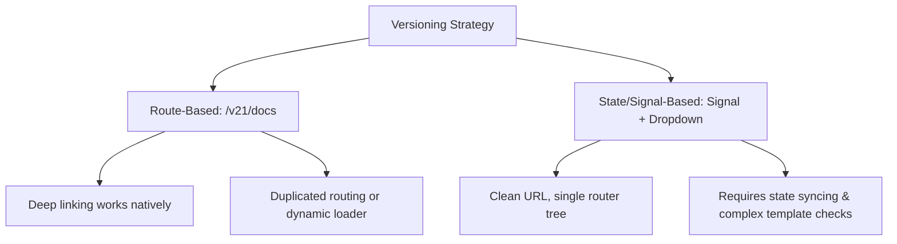

# Exploration: Angular Versioning & Branching Strategy

This document explores strategies for freezing Angular v21 documentation/code, versioning docs data/components, and designing a beautiful, accessible dropdown selector.

---

## 1. Branching Strategy to Freeze Angular 21

To support Angular v21 while moving `main` to Angular v22, we must establish a clear branching model.

### Approaches

#### Approach A: Dedicated Support Branch (`support/v21` or `v21-LTS`)

When transitioning `main` to Angular v22, cut a branch named `support/v21` from the last v21 commit.

- **Pros:**
  - Absolute separation of codebases: dependencies, tools, and breaking changes in v22 do not contaminate v21.
  - Zero run-time overhead or complex conditional branching in code.
  - Easy backporting of critical fixes via cherry-picking.
- **Cons:**
  - Deployment requires hosting two versions of the documentation site (e.g. `docs.angular-helpers.dev` for v22 and `v21.docs.angular-helpers.dev` for v21), or configuring a reverse proxy.
- **Effort:** Low (one-time branch setup, CI/CD pipeline tweak for double deployment).

#### Approach B: Unified Branch with Tag-based Archival

Maintain only the `main` branch and use Git tags (e.g., `v21.3.0`) for code freezes. No further documentation updates are backported.

- **Pros:**
  - Single-branch simplicity.
  - Zero CI/CD complexity.
- **Cons:**
  - No way to fix typos, bugs, or document new security/patch releases for v21.
- **Effort:** Low.

### Recommendation

**Approach A (`support/v21`)** is standard practice for modern open-source Angular libraries. It allows the community to submit PRs for v21 fixes and permits dedicated documentation deployments.

---

## 2. Document/Data Versioning Strategy

We need to decide how to version `*.data.ts` (e.g., `core.data.ts`) and demo components.

### Comparison of Approaches



### Approach 1: Route-Based Dynamic Versioning (`/v21/docs` vs `/docs`)

We dynamically inject a version parameter into the Angular router (e.g., `/docs/:version/core` or keep v22 as `/docs/core` and v21 as `/docs/v21/core`).

- **How it affects routes (`docs.routes.ts`):**
  ```typescript
  // We can define a dynamic parent or parameter:
  {
    path: ':version',
    children: [ ... ]
  }
  ```
- **How it affects resolvers (`overview.resolver.ts`):**
  The resolver reads the active version parameter and imports/injects the correct data set (e.g., `CORE_SERVICES_V21` vs `CORE_SERVICES_V22`).
- **Pros:**
  - Deep linking is completely native and SEO-friendly.
  - Refreshing the page preserves the active version automatically.
  - Easy to host on a single application instance.
- **Cons:**
  - Requires restructuring existing route configurations.
- **Effort:** Medium.

### Approach 2: State/Signal-Based Versioning with Query Parameter Sync

Maintain standard paths (`/docs/core`) and use a global `DocsVersionService` with a Signal that reads and writes a query parameter `?v=21`.

- **How it works:**
  A singleton service manages the state:
  ```typescript
  @Injectable({ providedIn: 'root' })
  export class DocsVersionService {
    readonly version = signal<'v21' | 'v22'>('v22');
    // Syncs with Router query params or localStorage
  }
  ```
  The components dynamically switch templates or data sources using Angular signals:
  ```typescript
  protected readonly services = computed(() =>
    this.version() === 'v21' ? CORE_SERVICES_V21 : CORE_SERVICES_V22
  );
  ```
- **Pros:**
  - Absolute URL structure cleanliness.
  - Extremely smooth transitions: switching version instantly recalculates signals and re-renders templates without router teardown.
- **Cons:**
  - High complexity if v21 and v22 have radically different APIs or component demos.
- **Effort:** Medium.

### Recommendation

**Approach 2 (State/Signal-Based with Query Parameter Sync)** is highly recommended. It showcases modern Angular capabilities (Signals, custom inject functions) while preserving quick transitions without page reloads.

---

## 3. Accessible Version Dropdown Design

A beautiful, accessible version selection dropdown in the header/layout.

### Accessibility Specs (WCAG AA Compliance)

- Proper ARIA roles: `role="combobox"`, `aria-expanded="false/true"`, `role="listbox"`, `role="option"`.
- Keyboard interaction: `ArrowDown`/`ArrowUp` to navigate options, `Enter`/`Space` to select, `Escape` to dismiss.
- Visual focus indicators: high contrast `:focus-visible` outline.

### Component Design (Tailwind + Standalone + Signals)

```typescript
import { Component, signal, HostListener, inject, ElementRef } from '@angular/core';
import { DocsVersionService } from '../services/docs-version.service';

@Component({
  selector: 'app-version-dropdown',
  standalone: true,
  template: `
    <div class="relative inline-block text-left">
      <button
        type="button"
        class="inline-flex justify-between items-center w-36 px-4 py-2 text-sm font-medium text-slate-700 bg-white border border-slate-300 rounded-lg shadow-sm hover:bg-slate-50 focus:outline-none focus:ring-2 focus:ring-offset-2 focus:ring-indigo-500 transition duration-150 ease-in-out dark:bg-slate-800 dark:text-slate-200 dark:border-slate-700"
        id="menu-button"
        aria-haspopup="listbox"
        [attr.aria-expanded]="isOpen()"
        (click)="toggle()"
      >
        <span>{{ currentVersionLabel() }}</span>
        <span class="ml-2 text-xs text-slate-400">▼</span>
      </button>

      @if (isOpen()) {
        <ul
          class="absolute right-0 w-36 mt-2 origin-top-right bg-white border border-slate-200 rounded-lg shadow-lg ring-1 ring-black ring-opacity-5 focus:outline-none z-50 dark:bg-slate-800 dark:border-slate-700"
          role="listbox"
          tabindex="-1"
        >
          @for (ver of versions; track ver.id) {
            <li
              class="cursor-pointer select-none relative py-2 pl-3 pr-9 text-sm text-slate-700 hover:bg-slate-100 hover:text-slate-900 transition dark:text-slate-300 dark:hover:bg-slate-700 dark:hover:text-white"
              role="option"
              [attr.aria-selected]="ver.id === currentVersion()"
              (click)="selectVersion(ver.id)"
            >
              <div class="flex items-center gap-2">
                <span class="font-semibold">{{ ver.label }}</span>
                @if (ver.badge) {
                  <span
                    class="px-1.5 py-0.5 text-[10px] font-bold rounded bg-indigo-100 text-indigo-800 dark:bg-indigo-900 dark:text-indigo-200"
                  >
                    {{ ver.badge }}
                  </span>
                }
              </div>
            </li>
          }
        </ul>
      }
    </div>
  `,
  styles: [
    `
      :host {
        display: block;
      }
    `,
  ],
})
export class VersionDropdownComponent {
  private readonly versionService = inject(DocsVersionService);
  private readonly elementRef = inject(ElementRef);

  protected readonly isOpen = signal(false);
  protected readonly currentVersion = this.versionService.version;
  protected readonly versions = [
    { id: 'v22', label: 'Angular 22', badge: 'Latest' },
    { id: 'v21', label: 'Angular 21', badge: 'LTS' },
  ];

  protected currentVersionLabel() {
    return this.versions.find((v) => v.id === this.currentVersion())?.label ?? 'Version';
  }

  protected toggle() {
    this.isOpen.update((open) => !open);
  }

  protected selectVersion(id: string) {
    this.versionService.setVersion(id as 'v21' | 'v22');
    this.isOpen.set(false);
  }

  @HostListener('document:click', ['$event'])
  protected onClickOutside(event: MouseEvent) {
    if (!this.elementRef.nativeElement.contains(event.target)) {
      this.isOpen.set(false);
    }
  }
}
```
