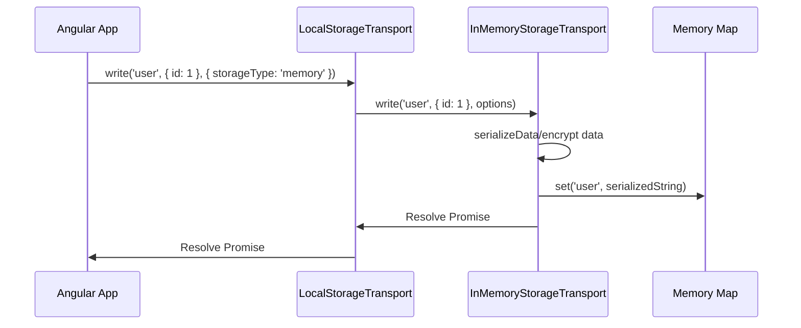

# SDD Technical Design: Add In-Memory Storage Transport

This document outlines the architectural approach for introducing `InMemoryStorageTransport` as an in-memory storage option within the `@angular-helpers/storage` package.

---

## 1. Technical Approach

We will implement a new `InMemoryStorageTransport` class that stores key-value pairs purely in an in-memory map. This provides a fast, non-persistent alternative to existing storage mechanisms (`local`, `session`, `indexeddb`, `cacheapi`), which is extremely useful for:

- Testing environments where disk/browser state shouldn't persist.
- Ephemeral/temporary session data.
- Server-Side Rendering (SSR) fallback scenarios where browser storage APIs are unavailable.

The transport will:

- Implement the `StorageTransport` interface.
- Respect serialization (`serializer: 'json' | 'toon'`) and security (`encrypt?: boolean`).
- Offer subscription capabilities (`onChange`) for reactive signal synchronization.

---

## 2. Architecture Decisions

### 2.1 In-Memory Storage Medium

We will use a native JavaScript `Map<string, string>` inside `InMemoryStorageTransport`.

- **Rationale**: Since other storage transports serialize data before writing it (to simulate actual I/O, encryption, and deep cloning safety), `InMemoryStorageTransport` will also serialize objects to string format using `serializeData` and `deserializeData` utility functions. This ensures consistent object references and matches L2 storage behaviors exactly.

### 2.2 Integration via LocalStorageTransport (Composite)

`LocalStorageTransport` acts as the primary composite entrypoint. We will register `InMemoryStorageTransport` inside it and expose `'memory'` as a valid target `storageType`.

---

## 3. Data Flow



---

## 4. File Changes

### 4.1 `packages/storage/worker/src/interfaces/storage-options.types.ts`

Add `'memory'` to the `storageType` union:

```typescript
export interface StorageSignalOptions<T = any> {
  storageType: 'local' | 'session' | 'indexeddb' | 'cacheapi' | 'memory';
  // ... rest of the fields
}
```

### 4.2 `packages/storage/src/services/local-transport.ts`

- Import `InMemoryStorageTransport`.
- Add `private readonly inMemory: InMemoryStorageTransport;`
- Update `public storageType` signature to include `'memory'`.
- Instantiate `InMemoryStorageTransport` inside the constructor.
- Add `case 'memory': return this.inMemory;` to `resolveTransport`.

### 4.3 `packages/storage/src/services/transports/in-memory.transport.ts`

Create the new file containing `InMemoryStorageTransport`.

---

## 5. Interfaces/Contracts

```typescript
export class InMemoryStorageTransport implements StorageTransport {
  private readonly store = new Map<string, string>();
  private readonly listeners = new Map<string, Set<(value: any) => void>>();

  constructor(private readonly secretPassphrase?: string) {}

  async read<T>(key: string, options?: StorageSignalOptions): Promise<T | undefined>;
  async write<T>(key: string, data: T, options?: StorageSignalOptions): Promise<void>;
  async delete(key: string, options?: StorageSignalOptions): Promise<void>;
  onChange<T>(key: string, callback: (value: T) => void): () => void;
}
```

---

## 6. Testing Strategy

We will write unit tests using **Vitest** in `packages/storage/src/services/transports/in-memory.transport.spec.ts` covering:

1. **Basic Operations**:
   - Write a value and read it back successfully.
   - Delete a value and verify `read` returns `undefined`.
2. **Data Isolation (Serialization)**:
   - Ensure modifying a retrieved object does not mutate the stored representation (deep isolation verification).
3. **Encryption Support**:
   - Verify reading and writing with `encrypt: true` works correctly and encrypts the underlying data in the internal map.
4. **Subscription Events (`onChange`)**:
   - Verify `onChange` receives the updated values when writing to a key, and that the unsubscribe function stops callbacks.
5. **Integration with `LocalStorageTransport`**:
   - Verify that setting `storageType: 'memory'` routes requests correctly to the in-memory transport.

---

## 7. Migration/Rollout

- **Backward Compatibility**: Fully backward compatible. The new `storageType: 'memory'` is purely opt-in.
- **Rollout Phase**: Direct integration under standard semantic versioning rules.

---

## 8. Open Questions

- Should we expose a mechanism to clear or inspect the entire in-memory store in non-production environments?
  - _Recommendation_: Keep it private to match the standard `StorageTransport` interface, but allow accessing the map in testing environments if necessary via typed checks.
