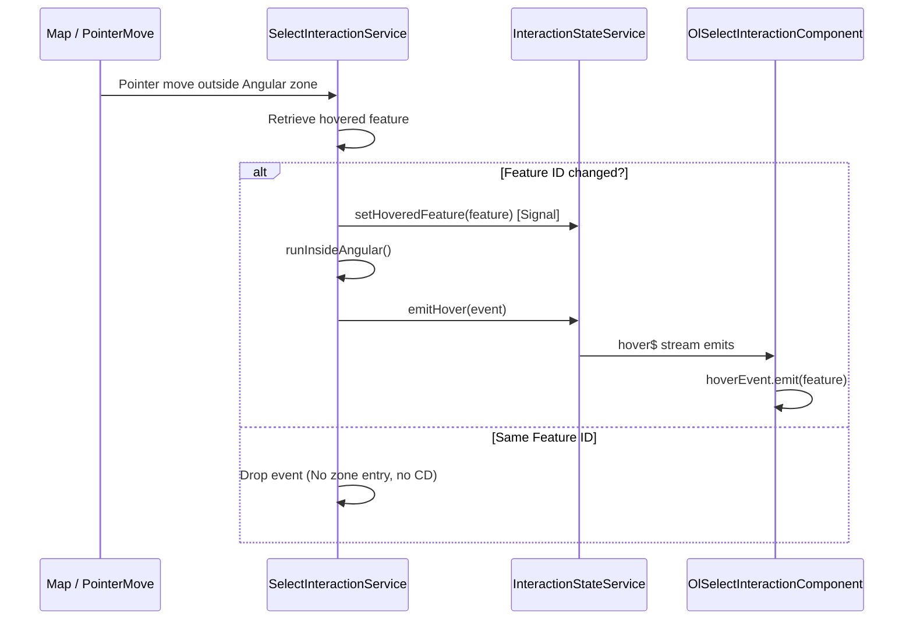

# Design: OpenLayers Improvements

## 1. Overview

This design outlines the implementation for improving geodesic sector rendering accuracy at large scales (>100km) and introducing a declarative, performance-optimized hover selection mechanism in Angular OpenLayers components.

---

## 2. Technical Approach

### Geodesic Sector Radial Lines (Approach B)

- Currently, `createSector` in [geometry.service.ts](file:///home/gasparrv92/Repositorios/angular-helpers/packages/openlayers/core/src/services/geometry.service.ts) generates geodesic-correct arc coordinates but leaves the straight radial lines (apex to start, end back to apex) undensified.
- **Approach B**: If the sector radius is greater than 100km, we will densify both radial lines with intermediate vertices. We will add 16 steps along the geodesic line using OpenLayers' `offset` function from `ol/sphere`.

### Declarative Hover Selection (Approach A)

- **Approach A**: Expose a dedicated `hoverEvent` output in `OlSelectInteractionComponent` emitting the hovered `Feature | null`.
- Avoid reusing `selectEvent` to keep click selection and hover states separated.

---

## 3. Architecture & Performance Decisions

To prevent mouse movement events from flooding Angular's change-detection:

1. **Execution Outside Zone**: The pointerMove event is captured by the OpenLayers interaction which is instantiated and run outside Angular zone.
2. **ID Filtering**: The callback filters out redundant movements within the same feature by tracking `lastHoveredId` on the service level.
3. **Targeted Zone Entry**: We only enter the Angular zone (using `OlZoneHelper.runInsideAngular`) and trigger `hover$` emissions when the hovered feature ID changes.



---

## 4. Interfaces & Contracts

### Event Interface

Added to [interaction.types.ts](file:///home/gasparrv92/Repositorios/angular-helpers/packages/openlayers/interactions/src/models/interaction.types.ts):

```typescript
export interface SelectHoverEvent {
  interactionId: string;
  feature: Feature | null;
}
```

### Component Output

Exposed on `OlSelectInteractionComponent`:

```typescript
hoverEvent = output<Feature | null>();
```

---

## 5. Detailed File Changes List

### 1. `packages/openlayers/core/src/services/geometry.service.ts`

- Modify `createSector(config: SectorConfig): Feature`
- Add threshold: `const RADIAL_DENSIFICATION_THRESHOLD = 100_000;` (100 km).
- If `radius > RADIAL_DENSIFICATION_THRESHOLD`, densify radial paths with `radialSteps = 16`.
- First edge (center to arc start): loop `i` from `0` to `radialSteps - 1` to generate points along `startBearing`.
- Arc path: loop `i` from `0` to `segments`.
- Second edge (arc end to center): loop `i` from `radialSteps - 1` down to `0` along `endBearing`.

### 2. `packages/openlayers/interactions/src/models/interaction.types.ts`

- Declare `SelectHoverEvent` interface.

### 3. `packages/openlayers/interactions/src/services/interaction-state.service.ts`

- Add private `hoverSubject = new Subject<SelectHoverEvent>();`.
- Expose `readonly hover$ = this.hoverSubject.asObservable();`.
- Implement `emitHover(event: SelectHoverEvent): void`.

### 4. `packages/openlayers/interactions/src/services/interaction.service.ts`

- Delegate `readonly hover$ = this.stateService.hover$;`.

### 5. `packages/openlayers/interactions/src/services/select-interaction.service.ts`

- Maintain local state: `let lastHoveredId: string | number | null | undefined = undefined;`.
- Update selection listener to track hover changes on `pointerMove`.
- Guard zone transition and event stream emission with `currentId !== lastHoveredId`.

### 6. `packages/openlayers/interactions/src/features/select-interaction.component.ts`

- Declare `hoverEvent = output<Feature | null>();`.
- Subscribe to `interactionService.hover$` inside constructor.
- Filter event by `interactionId === this.id()`.
- Emit via `hoverEvent`. Ensure subscription is cleaned up using `takeUntilDestroyed`.

---

## 6. Testing Strategy

1. **Geometry Tests**:
   - Verify `createSector` with `radius <= 100_000` preserves the standard `segments + 3` coordinates.
   - Verify `createSector` with `radius > 100_000` outputs extra coordinates (`segments + 3 + (radialSteps - 1) * 2` points, which is `32 + 3 + 15 * 2 = 65` points when using 16 steps).
   - Assert all intermediate points lie precisely on the geodesic path.

2. **Hover / Change Detection Tests**:
   - Mock OpenLayers interaction events.
   - Verify `hover$` emits only when feature transitions occur.
   - Verify Angular zone execution counts match transition counts.
