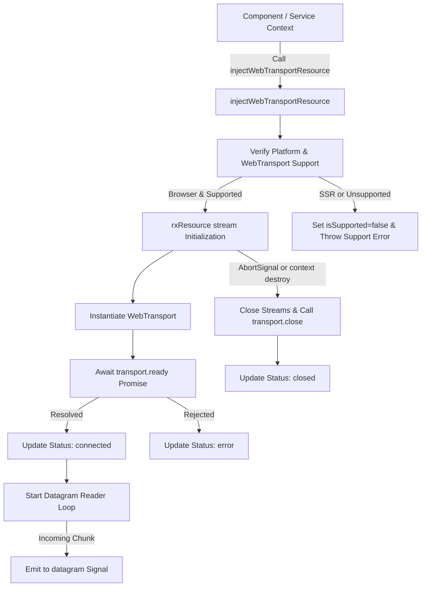

# Design: WebTransport Resource Primitives (`injectWebTransportResource`, `injectWebTransport`)

## Technical Approach

Implement `injectWebTransportResource()` and `injectWebTransport()` as functional Signal-based primitives in `packages/browser-web-apis/src/fns/inject-web-transport-resource.ts`.

The primitives integrate WebTransport lifecycle with Angular's `rxResource` API (from `@angular/core/rxjs-interop`), offering reactive URL management, status tracking (`connecting`, `connected`, `closed`, `error`), datagram signals, stream creation helpers, and teardown tied to `AbortSignal` and Angular `DestroyRef`.

## Architecture & Data Flow



1. **Injection Context Guard**: Ensures invocation inside Angular injection context (`assertInInjectionContext`). Checks `PLATFORM_ID` and `globalThis.WebTransport` availability.
2. **Reactive Parameter Resolution**: Accepts URL as `string`, `Signal<string>`, or getter function `() => string | null | undefined`.
3. **`rxResource` Stream**:
   - Manages connection instantiation inside `stream: ({ params, abortSignal }) => Observable<WebTransportSessionInfo>`.
   - Monitors `transport.ready` and `transport.closed` promises.
   - Operates `transport.datagrams.readable` reader loop emitting chunks to a dedicated `datagram` signal.
   - Cleans up streams and closes session on `abortSignal` emit or teardown.

## Interfaces & Contracts

```typescript
export type WebTransportStatus = 'connecting' | 'connected' | 'closed' | 'error';

export interface WebTransportResourceOptions extends WebTransportOptions {
  /** Optional auto-connect flag. Defaults to true. */
  autoConnect?: boolean;
}

export interface WebTransportSessionInfo {
  transport: WebTransport;
  url: string;
}

export interface WebTransportResourceRef {
  /** The underlying rxResource instance */
  readonly resource: ResourceRef<WebTransportSessionInfo | null>;
  /** Reactive status signal */
  readonly status: Signal<WebTransportStatus>;
  /** Latest datagram payload signal */
  readonly datagram: Signal<Uint8Array | null>;
  /** Signal indicating whether WebTransport is supported in the current environment */
  readonly isSupported: Signal<boolean>;
  /** Send datagram payload over datagrams.writable */
  sendDatagram(data: Uint8Array | ArrayBuffer): Promise<void>;
  /** Create outgoing unidirectional stream */
  createUnidirectionalStream(
    options?: WritableStreamSubmitOptions,
  ): Promise<WritableStream<Uint8Array>>;
  /** Create outgoing bidirectional stream */
  createBidirectionalStream(): Promise<WebTransportBidirectionalStream>;
  /** Incoming unidirectional streams */
  readonly incomingUnidirectionalStreams: ReadableStream<ReadableStream<Uint8Array>> | null;
  /** Incoming bidirectional streams */
  readonly incomingBidirectionalStreams: ReadableStream<WebTransportBidirectionalStream> | null;
  /** Explicitly close transport session */
  close(closeInfo?: WebTransportCloseInfo): void;
}

export function injectWebTransportResource(
  url: string | Signal<string | null | undefined> | (() => string | null | undefined),
  options?: WebTransportResourceOptions,
): WebTransportResourceRef;

export function injectWebTransport(
  url: string | Signal<string | null | undefined> | (() => string | null | undefined),
  options?: WebTransportResourceOptions,
): WebTransportResourceRef;
```

## File Changes

- **New**: `packages/browser-web-apis/src/fns/inject-web-transport-resource.ts`
  - Functional primitive implementation, type definitions, and `rxResource` setup.
- **New**: `packages/browser-web-apis/src/fns/inject-web-transport-resource.spec.ts`
  - Vitest unit tests covering creation, status transitions, datagram signaling, stream creation, and cleanup.
- **Modified**: `packages/browser-web-apis/src/public-api.ts`
  - Export `injectWebTransportResource`, `injectWebTransport`, `WebTransportResourceRef`, `WebTransportResourceOptions`, and `WebTransportStatus`.

## Testing Strategy

- Use Vitest unit tests with `TestBed.runInInjectionContext`.
- Mock global `WebTransport` constructor with mock `ready`, `closed`, `datagrams`, `createUnidirectionalStream`, and `createBidirectionalStream`.
- Test scenarios:
  1. **SSR / Support Guard**: Verify unsupported environment returns `isSupported() === false` without throwing synchronously.
  2. **Lifecycle Transitions**: Test transition from `connecting` to `connected` on `ready` resolve, and `closed` on disconnect.
  3. **Datagram Handling**: Verify incoming datagrams update `datagram` signal, and `sendDatagram()` writes to `datagrams.writable`.
  4. **Multiplexed Streams**: Validate `createUnidirectionalStream()` and `createBidirectionalStream()` delegate to underlying session instance.
  5. **Resource Teardown**: Ensure `AbortSignal` trigger or TestBed destruction calls `transport.close()`.
