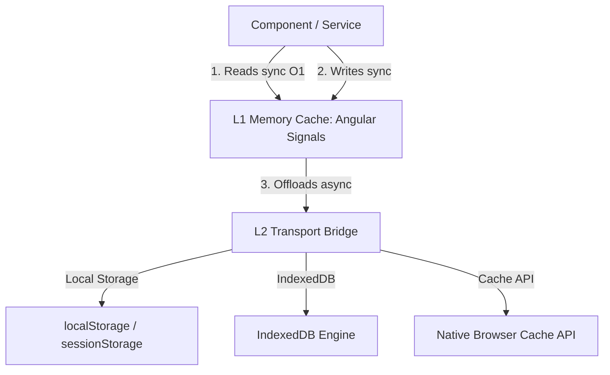

# L1/L2 Reactive Storage, but it actually scales

State management in Angular has evolved, but persistence mechanisms are often stuck in the past. Standard libraries force developers to choose between blocking synchronous operations (`localStorage` / `sessionStorage`) or awkward asynchronous stream pipelines (`IndexedDB` / `Cache API`) that trigger constant change detection runs and visible UI jank.

With `@angular-helpers/storage` v21.12.0, we are introducing a modern, reactive, two-tier (L1/L2) storage solution designed from the ground up for Angular. It marries a high-speed, synchronous **L1 memory Signal Cache** with flexible, non-blocking **L2 async storage engines** to deliver flawless 60 FPS interfaces.

---

## 💡 The Architecture: L1/L2 Bridging

The core philosophy of `@angular-helpers/storage` is **read synchronous, write asynchronous**.



- **L1 (Signal Cache)**: Holds the current value in memory. Reading is a zero-latency, synchronous operation that returns an Angular signal. Your components can bind to it directly, ensuring immediate UI updates.
- **L2 (Async Persister)**: Backends like **IndexedDB** or the browser's native **Cache API** are handled completely in the background. Writes are queued and offloaded, preventing the main thread from blocking.

---

## ⚡ Basic Storage Signals

Using it in your components is extremely simple. The `injectStorageSignal` helper automatically manages initialization, loading states, and reactive updates:

```typescript
import { Component } from '@angular/core';
import { injectStorageSignal } from '@angular-helpers/storage';

@Component({
  selector: 'app-user-preferences',
  template: `
    @if (theme().loading) {
      <span class="spinner">Loading preferences...</span>
    } @else {
      <div [class]="theme().data">
        <p>Current Theme: {{ theme().data }}</p>
        <button (click)="toggleTheme()">Toggle Dark Mode</button>
      </div>
    }
  `,
})
export class UserPreferencesComponent {
  // L1 Signal backed by L2 Cache API
  protected readonly theme = injectStorageSignal('app-theme', 'light', {
    storageType: 'cacheapi',
    serializer: 'json',
  });

  toggleTheme() {
    const nextTheme = this.theme().data === 'light' ? 'dark' : 'light';
    this.theme.set({ data: nextTheme, loading: false, error: null });
  }
}
```

---

## 🧬 High-Performance Entity Store

When dealing with large sets of structured entities (e.g., product catalogs, messaging feeds, map overlays), reactive scaling becomes difficult. If one element changes in a standard list, your entire array signal re-evaluates.

`injectEntityStore` solves this by introducing **Surgical Granular Reactivity** and **Runtime Immutability**:

```typescript
import { injectEntityStore } from '@angular-helpers/storage';

interface Product {
  id: string;
  name: string;
  price: number;
}

const productStore = injectEntityStore<string, Product>({
  idKey: 'id',
  persistKey: 'products-cache',
  storageOptions: {
    storageType: 'indexeddb',
    serializer: 'toon', // Uses Token-Oriented Object Notation compression
  },
});

// 1. Write-Once, Freeze-Once O(1) insertion
productStore.setOne({ id: 'P1', name: 'Ultra-wide Monitor', price: 599 });

// 2. Read entities safely (frozen in runtime, compile-time ReadonlyMap)
const monitor = productStore.entities().get('P1');
// monitor.price = 499; // ❌ Throws TypeError in runtime & compile error in TS!

// 3. Surgical Granular Reactivity
// This signal ONLY evaluates when product 'P1' is updated.
// Edits to product 'P2' or 'P3' will NOT trigger a re-run!
const productSignal = productStore.entitySignal('P1');
const priceSignal = computed(() => productSignal()?.price);
```

---

## 🦾 Under the Hood: Advanced Performance Primitives

### 1. TOON (Token-Oriented Object Notation) Compression

Most API responses are uniform arrays of objects with repeating keys. TOON strips repetitive schema definitions into a separate header block, compressing payload sizes by **30-60%** before saving to disk. This allows developers to easily bypass standard `5MB` local storage limits while drastically reducing serialization overhead.

### 2. Runtime Immutability (Write-Once, Freeze-Once)

Instead of paying a deep-clone tax on every single read operation, `@angular-helpers/storage` uses `Object.freeze` selectively on write/set cycles. Reads remain extremely fast native object accesses, while developers get runtime and compile-time guarantees against state mutation side effects.

### 3. Native Cache API for Payload Parsing

By leveraging native `window.caches`, L2 reads offload heavy parsing. The browser handles JSON or TOON parsing off the main thread natively via `Response.json()`, freeing valuable main thread CPU cycles for rendering interactive elements and smooth animations.

### 4. Hardware-Accelerated AES-GCM Encryption

Hardware-accelerated client-side encryption is built-in. Simply pass your key config to encrypt sensitive data at rest using standard native WebCrypto algorithms.

---

## 🛠️ Performance & Robustness Checklist

- **Incognito & Sandboxed Graceful Degradation**: Safari private browsing or sandboxed iframes without `allow-same-origin` throw `SecurityError`s when attempting writes. The library automatically probes capabilities on startup and falls back to in-memory safety gracefully.
- **Micro-evaluation Boundary**: Changing item `A` does not force components listening to item `B` to recalculate. State is sliced symmetrically.
- **Tree-shakeable Transports**: Only import the persister engines you actually use. `LocalStorageTransport`, `IndexedDBTransport`, and `CacheApiTransport` are fully modular and tree-shakeable.

---

## 🚀 Get Started

Install the library today:

```bash
npm install @angular-helpers/storage
```

Explore the live, interactive demo dashboard in your app to see the L1/L2 Cache API in action, complete with CPU-burning thread checks and real-time serialization metrics!
